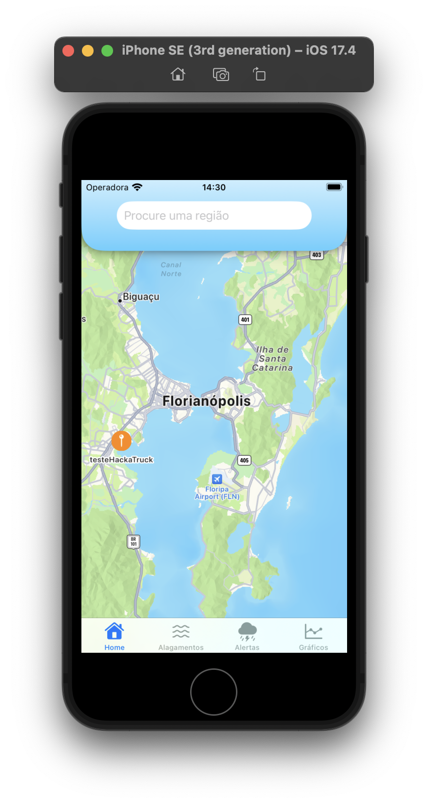
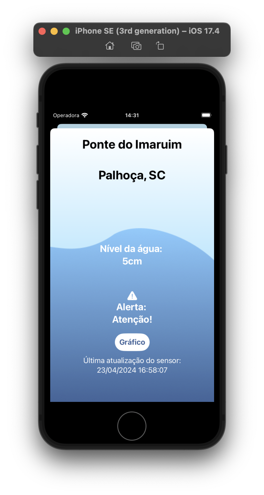
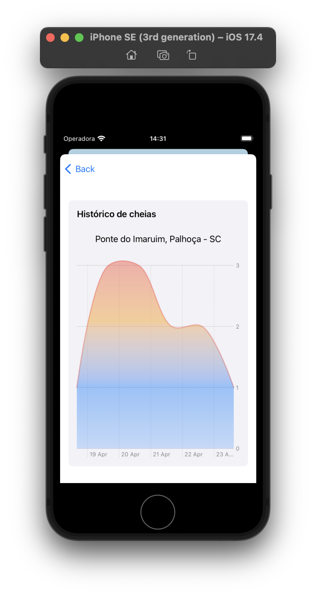
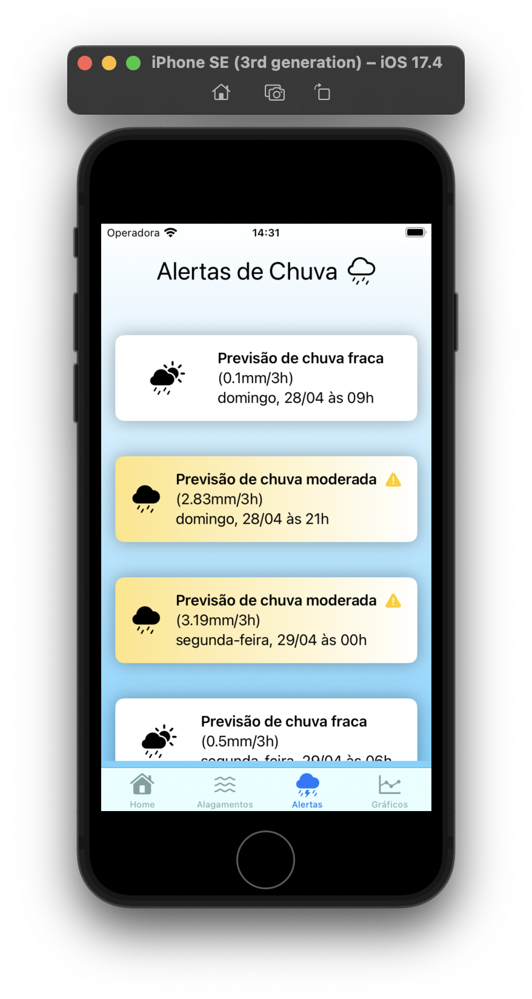
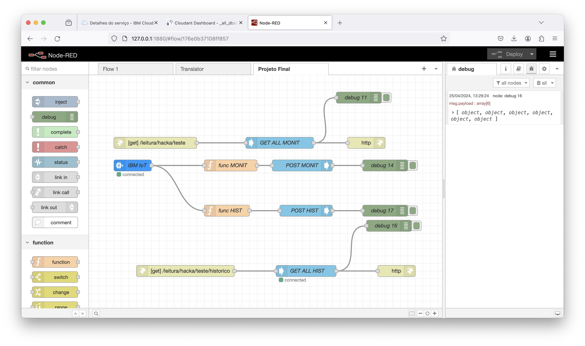

# Monitor de Cheias

Este repositório contém o código fonte de um aplicativo iOS desenvolvido em Swift para monitorar o nível de água de rios, alertando sobre possíveis enchentes e mantendo os moradores da região informados. Abaixo estão as principais características do aplicativo:

## Principais Recursos

- **Comunicação MQTT**: Integração com sensores de nível de água via MQTT para obter as leituras.
- **Visualização de Mapa**: Utiliza o framework MapKit para localizar os pontos monitorados em um mapa interativo.
- **Gráficos de Histórico**: Apresenta um gráfico com o histórico do nível do rio em cada ponto monitorado, utilizando a biblioteca Charts.
- **Alertas Meteorológicos**: Utiliza uma API pública de previsão do tempo para alertar os usuários sobre as próximas chuvas e suas intensidades.

## Capturas de Tela

### Mapa de Pontos Monitorados

### Leitura Atual do Sensor

### Gráfico de Histórico do Nível de Água

### Previsão do Tempo

## Node-RED

Além do aplicativo iOS, este projeto inclui uma configuração Node-RED para facilitar a integração com os sensores de nível de água. O Node-RED é uma ferramenta de código aberto que permite a conexão de dispositivos de hardware, APIs e serviços online de maneira visual e interativa.

### Fluxo do Node-RED

### Sobre o Projeto
Desenvolvido durante o curso HackaTruck pelos alunos Arthur Sauer, Giuseppe Castro, Louisi Dalazen e Vinicius Matheus de Souza.
